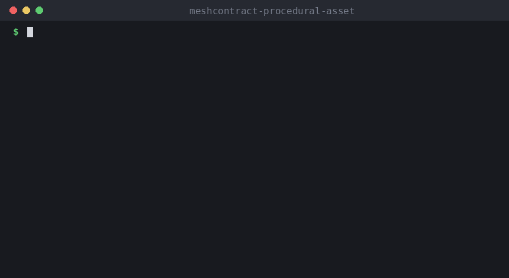

# MeshContract Procedural Asset

**The asset generator still works, but a geometry regression violates the asset
contract, so CI blocks it.**

A geometry-only low-poly treasure chest and a compact integration demo for
[MeshContract](https://github.com/Ikonido/MeshContract). The generator uses only
the Python standard library; Blender is not required.

```text
procedural generator
        ↓
     OBJ asset
        ↓
   MeshContract
        ↓
PASS / FAIL quality gate
```

MeshContract is the source of every PASS/FAIL decision. The flow also fits
assets generated by AI agents: generate → validate → accept or reject.

## The main scenario

| | Generator parameter | Width | Result |
|---|---|---|---|
| Baseline | default | 1.444 m | PASS |
| Regression | width × 1.5 | 2.166 m | FAIL: `max_width_m_exceeded` (limit 2.0 m) |



Run it (Python 3.11 or 3.12):

```sh
python -m pip install -r requirements-ci.txt
python scripts/demo_pipeline.py
```

```text
1. Generate the procedural chest (baseline parameters)
   asset generated
2. Check the baseline against contract.yaml
   Dimensions: width=1.444 m, length=0.939 m, height=1.022 m
   PASS — contract satisfied
   -> PASS (exit code 0)
3. Change one generator parameter: width x 1.5
   same generator, new geometry
4. Check the regenerated asset
   -> FAIL (exit code 1)
   max_width_m_exceeded: width 2.166 m > limit 2.0 m
5. Quality gate: BLOCKED - the regression would not be accepted
```

The contract (`contract.yaml`) caps the mesh at 5,000 triangles and 3,000
vertices, width and depth at 2 m, height at 3 m, and rejects faces with more
than four vertices.

## Try the pieces

```sh
python generate_mesh.py                      # writes asset.obj
meshcontract check asset.obj --contract contract.yaml          # PASS, exit 0

python generate_mesh.py --variant regression --output regression_asset.obj
meshcontract check regression_asset.obj --contract contract.yaml --format json
# exit 1, violation code max_width_m_exceeded
```

The `regression` variant is the same chest built by the same generator with its
width scaled by 1.5. The `invalid` variant is a separate small box, wider than
2 m, used to check MeshContract's failure and JSON interfaces on their own.

## Quality gate and CI

```sh
python generate_mesh.py --variant invalid --output invalid_asset.obj
python scripts/verify_quality_gate.py asset.obj invalid_asset.obj regression_asset.obj
```

`verify_quality_gate.py` prints a diagnostic report ending in
`OVERALL QUALITY GATE: PASS`. Here PASS means the pipeline classified every case
correctly: MeshContract failing on the invalid and regression assets is the
*expected* outcome, not a pipeline failure.

GitHub Actions (Python 3.11 and 3.12) checks that:

- the generator output is reproducible and matches the committed `asset.obj`
  byte for byte (`scripts/check_reproducibility.py` and `git diff --exit-code`);
- the baseline passes, and the invalid and regression assets exit with code 1;
- the regression reports exactly `max_width_m_exceeded`;
- the demo pipeline runs.

## Reproducibility

`asset.obj` is committed and must equal the generator's output. Coordinates are
written with six decimals and never as `-0.000000`, so results do not depend on
the platform's floating-point rounding of tiny values. After changing the
generator, run `python generate_mesh.py` and commit the updated `asset.obj`;
otherwise CI fails.
